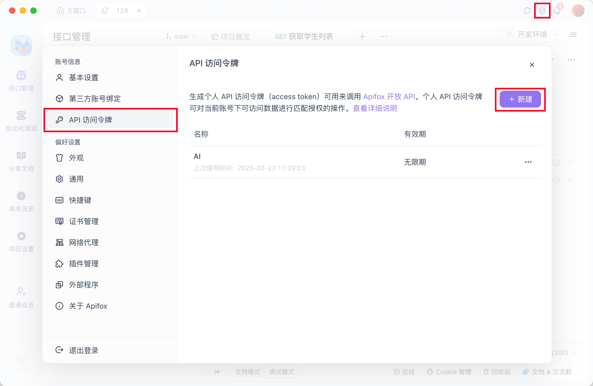
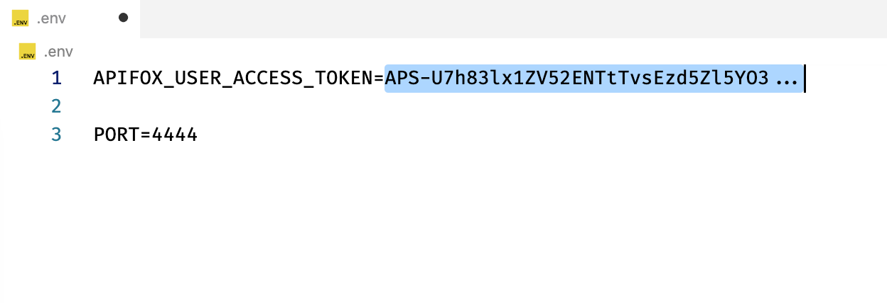
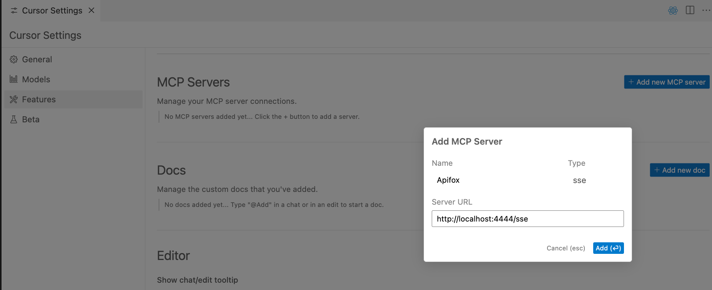
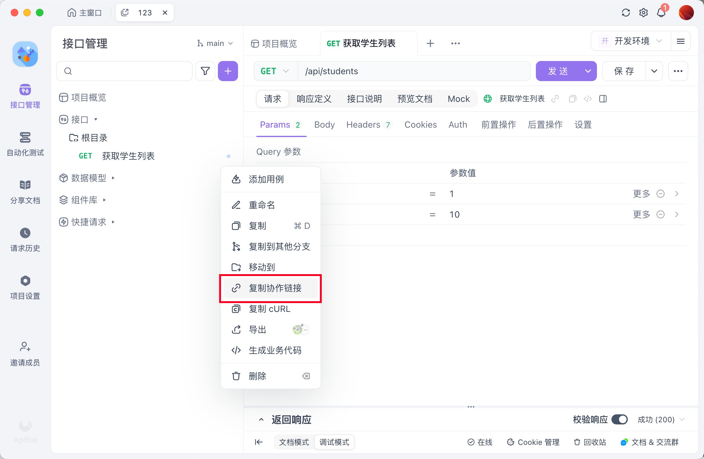
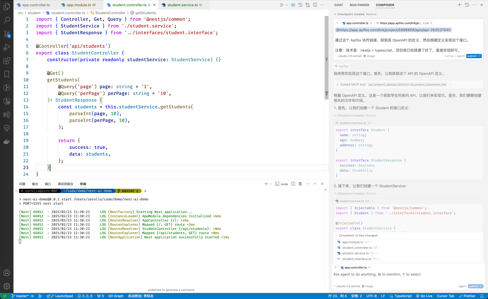
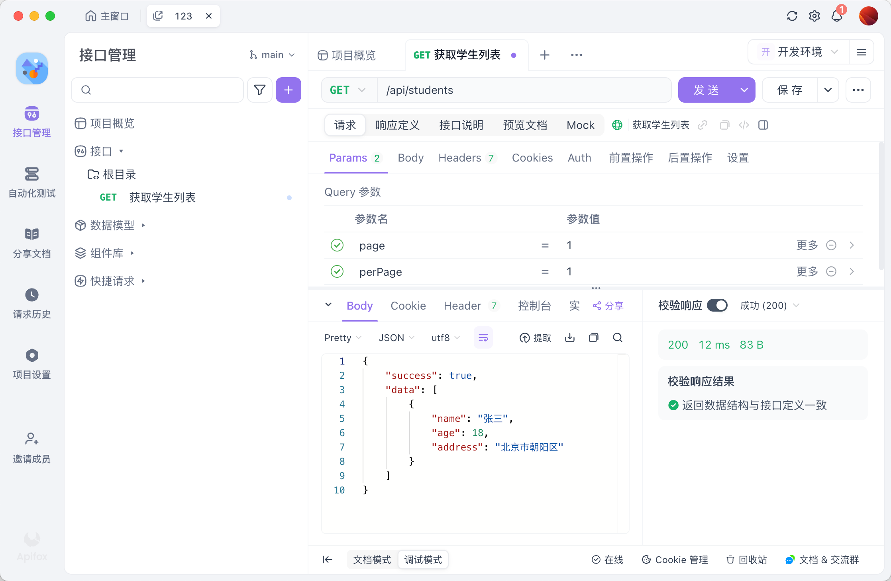
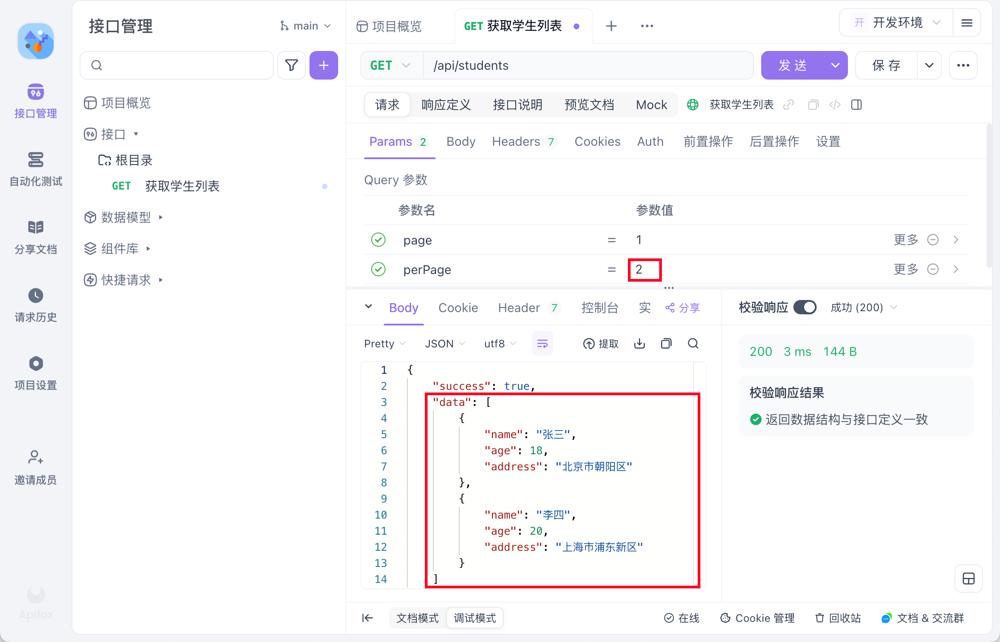

## 环境要求

- NodeJS >= 18

## 1. 准备 Apifox MCP 服务

### 1.1 克隆 Apifox MCP 项目

```shell
git clone https://github.com/Tzott/apifox-mcp-demo.git
```

### 1.2 创建环境变量

```shell
cd apifox-mcp-demo
cp .env.example .env
```

### 1.3 在 Apifox 客户端中创建一个Access Token ，并写入到 .env 文件中





### 1.4 启动 Apifox MCP 服务

```shell
# 如果没有安装 pnpm，可先运行：npm i -g pnpm

pnpm i && pnpm build && pnpm start
```

### 1.5 看到启动成功日志

```shell
> apifox-mcp-demo@0.0.1 start /Users/code/apifox-mcp-demo
> node lib/index.js

SSE endpoint: http://localhost:4444/sse
Message endpoint: http://localhost:4444/messages
HTTP server listening on port 4444
```

## 2. 准备 Cursor

### 2.1 创建一个空白的 Nestjs 项目

```shell
npm i -g @nestjs/cli
nest new nest-ai-demo
cd nest-ai-demo
```

### 2.2 添加一个 Cursor MCP 配置

从 `apifox-mcp-demo` 项目中复制 `sse 的地址`，填到 `Server URL` 中。



可以看到MCP 服务连接成功


### 2.3 打开 Cursor Composer，并切换到 Agent 模式


### 2.4 复制一个 Apifox 接口的协作链接



### 2.5 粘贴到 Composer 中，并让其实现接口

```plaintext
https://app.apifox.com/link/project/5898808/apis/api-263537040

通过这个 Apifox 协作链接，获取其 OpenAPI 的定义，然后根据定义实现这个接口。

注意：技术是：nestjs + typescript，项目我已经搭建了好了，直接实现即可。
```

### 2.6 Cursor Composer 实现完毕，并 Accepted 结果



### 2.7 启动 Nestjs服务，通过 Apifox 调用AI 写的接口，断言通过



## 3. 其他

分页也简单实现了

